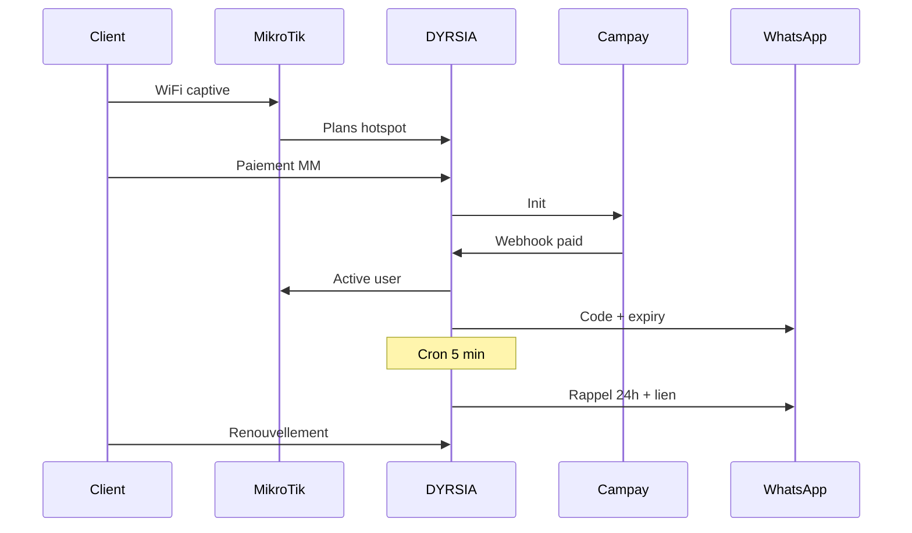

# Workflow opérationnel DYRSIA — journée type

Ce document décrit le cycle automatique et manuel de la plateforme une fois la [stack d'intégration](integration-stack.md) configurée.

## Matin (automatisé — cron toutes les 5 min)

| Heure | Système | Action |
|---|---|---|
| 00:00–23:55 | `cron_wifizone.php` | File paiements, rappels J-7/J-3/24h, expirations, GenieACS (1×/h), backups |
| 07:00 | `cron.php` (via ops) | Sync data usage MikroTik, ping routeurs |
| Sur alerte | Telegram | Paiement échoué, cron mort, routeur offline |

## Parcours client hotspot

1. Connexion WiFi → portail captive (`login.html` sur MikroTik)
2. Choix forfait → Campay Mobile Money
3. Webhook `paid` → activation voucher sur routeur
4. WhatsApp : code + date expiration
5. J-7, J-3, 24 h avant fin → rappel + `[[payment_link]]`
6. Expiration → coupure auto (`Package::processExpiredRecharges`)

## Parcours admin ISP

1. **Setup wizard** (dashboard) : routeur → forfait → Campay → WhatsApp → cron → rappels
2. Vente voucher / monitoring clients / reversements finance
3. Abonnement DYRSIA (trial → CamPay → actif)

## Parcours PPPoE expiré

1. Client coupé → NAT MikroTik vers portail PPPoE
2. Renouvellement Campay → réactivation

## SuperAdmin

- Instances tenants (`provision`)
- Tarifs SaaS (`superadmin/isp-settings`)
- Reversements retraits

## Commandes CLI utiles

```bash
# Cron manuel
php system/cron_wifizone.php

# Test rappels (dry-run via cron_wifizone ou logs notifications)

# Diagnostic MikroTik : Paramètres routeur / sync API dans l'admin
```

## Schéma


